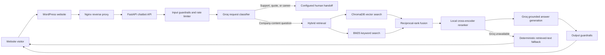

# Matrix Media Website Assistant

## Project overview

This project provides a secure, cost-conscious chatbot for the Matrix Media website. It answers visitors using approved Matrix Media website content supplied as PDF and text files. The chatbot is designed for prospective and existing clients first; job and recruitment questions are routed to careers separately.

The service is built in Python with FastAPI, runs asynchronously, uses Groq for request classification and grounded answer generation, and is deployable with Docker behind the Matrix Media WordPress website.

## Business objectives

- Give website visitors quick, useful answers about Matrix Media services, team, case studies, policies, and company information.
- Keep responses aligned with Matrix Media’s first-person-plural brand voice: “we”, “us”, and “our”.
- Direct quote, project, support, and career requests to the correct human channel rather than attempting to automate a business decision.
- Avoid unsupported answers and reduce the chance of hallucinations.
- Keep recurring API costs low for an expected average of 100 daily visitors.

## Scope

### Included

- Ingestion of `.pdf` and `.txt` files supplied in the project folder.
- Semantic chunking, local embeddings, ChromaDB vector storage, keyword retrieval, and reranking.
- FastAPI chatbot endpoint and health check.
- Groq-powered routing and answer generation.
- Input/output guardrails, request-size checks, and rate limiting.
- Nginx reverse proxy configuration for Docker and WordPress integration.
- Automated evaluation for routes, retrieval, factual coverage, faithfulness, relevance, and interaction success.

### Not included

- A replacement for a support desk, CRM, applicant-tracking system, or human sales process.
- Persistent visitor chat history.
- Live external data such as weather, news, prices, or stock information.
- Any answer not supported by Matrix Media’s indexed material.

## Architecture



## Document ingestion and indexing

### Source material

The ingestion process reads Matrix Media’s supplied PDFs and text files. The files remain in the project environment; no document content or embeddings are sent to Groq.

### Semantic chunking

Documents are split at meaningful paragraph and sentence boundaries. Adjacent content is grouped when it is semantically related, then limited to a maximum token size so that each retrieved result remains focused and affordable to send to the LLM.

Each chunk stores metadata including:

- Source file and document title
- Page number and section information
- Chunk identifier and sequence position
- Content and embedding token counts

### Local embedding and storage

The `BAAI/bge-base-en-v1.5` embedding model runs locally through FastEmbed. It creates vectors once during ingestion and uses the same model to embed each visitor question. Vectors are persisted in ChromaDB under `storage/chroma`; chunk metadata is stored in `storage/index.json`.

## Request flow

1. A visitor sends a message to `POST /v1/chat`.
2. FastAPI validates the request, normalises text, limits message size, and blocks obvious prompt-injection or sensitive-payment-data patterns.
3. A lightweight Groq classifier selects one route: `rag`, `escalation`, `support`, or `career`.
4. Exact greetings return a client-focused welcome message. Explicit recruitment wording always uses the career route.
5. Quote/project/human requests receive an escalation handoff. Existing-client incidents receive a support handoff. These routes do not run retrieval.
6. For a company-information question, the system embeds the question locally and performs hybrid retrieval.
7. The system takes the final top five chunks, if their dense-retrieval relevance clears the configured threshold.
8. Groq generates a concise response using only those chunks. The answer is checked and shortened by output guardrails before it is returned.
9. If Groq is unavailable or times out after relevant content is found, the API returns a deterministic answer composed from retrieved content.
10. If no sufficiently relevant Matrix Media content is found, the API returns a strict no-match message instead of guessing.

## Hybrid retrieval approach

Retrieval combines three local methods:

| Layer | Purpose |
|---|---|
| ChromaDB dense vector retrieval | Finds semantic matches, including paraphrased visitor questions. |
| BM25 keyword retrieval | Finds exact terminology, service names, document titles, and headings. |
| Reciprocal-rank fusion | Combines the two ranked lists without relying on incompatible score scales. |
| MiniLM cross-encoder reranker | Reads the question and candidate chunk together, then ranks the best 18 candidates before returning the final top five. |

This combination performs more reliably than vector search alone when visitors phrase questions differently from the original website copy.

## Model configuration

| Purpose | Technology | Operation |
|---|---|---|
| Request classification | Groq lightweight model | Deterministic JSON route, low token limit |
| Answer generation | Groq `llama-3.1-8b-instant` | Temperature `0.1`, top-p `0.3`, maximum 300 tokens |
| Query and document embeddings | `BAAI/bge-base-en-v1.5` | Local FastEmbed model |
| Reranking | `Xenova/ms-marco-MiniLM-L-6-v2` | Local cross-encoder model |
| Vector database | ChromaDB | Local persistent storage |

Low-temperature settings favour repeatable, evidence-led answers over creative responses.

## Guardrails and security controls

- Visitor messages are restricted to 1,000 characters and request bodies to 16 KB.
- Obvious prompt-injection instructions are rejected.
- Likely payment-card numbers and US Social Security numbers are rejected before they reach the model.
- Groq is instructed to answer only from retrieved Matrix Media context.
- Output filtering removes accidental key-like values, strips excessive whitespace, and limits output length.
- FastAPI applies per-IP rate limiting; Nginx provides an additional proxy-level rate limit.
- Responses use `Cache-Control: no-store`, `X-Content-Type-Options: nosniff`, and `X-Frame-Options: DENY` headers.
- The API key is held in `.env` on the server and is never placed in WordPress, browser JavaScript, or PHP.

## Consent-based follow-up capture

When a visitor explicitly asks for a follow-up (for example, “please call me” or “contact me”), or clearly indicates interest in Matrix Media services while providing contact details, the API saves a follow-up lead locally. One contact method is sufficient: email address, phone number, or website URL. Name is optional. The record contains supplied name/contact details, the visitor message, creation timestamp, and a 90-day expiry by default. Career enquiries are excluded from client-lead capture.

- Contact data is redacted before the message is sent to Groq for classification or answer generation.
- A message that merely contains an email address, phone number, or website URL is **not** stored; it must also contain a follow-up request or clear client-service interest.
- Follow-up data is stored in a persistent Docker volume, separate from the public chatbot API.
- The internal `GET /v1/admin/follow-ups` endpoint returns stored leads only when `FOLLOW_UP_ADMIN_TOKEN` is configured and supplied in the `X-Follow-Up-Admin-Token` request header. Do not expose this endpoint through the public WordPress proxy.
- Set `FOLLOW_UP_RETENTION_DAYS` to the company-approved retention period and restrict operational access to authorised personnel.
- Each successful insert writes a redacted confirmation to the API terminal, showing the lead ID and which contact fields were captured. Full personal data is intentionally not printed in application logs.

When testing the Streamlit frontend against Docker, it uses the Nginx proxy endpoint `http://localhost:8080/api/chat/chat`. For direct Uvicorn testing, set `CHAT_API_URL=http://localhost:8000/v1/chat` before launching Streamlit.

For a multi-container or multi-server production deployment, replace FastAPI’s in-memory rate limiter with a shared Redis-backed limiter.

## API contract

### Chat endpoint

`POST /v1/chat`

Request:

```json
{
  "message": "What services does Matrix Media provide?"
}
```

Response:

```json
{
  "answer": "...",
  "sources": [
    {
      "document": "Design & Development Notes - Service Pages.pdf",
      "page": 3,
      "score": 0.72,
      "hybrid_score": 0.02,
      "rerank_score": 3.14
    }
  ],
  "mode": "generated",
  "route": "rag"
}
```

Possible response modes are `generated`, `retrieval_fallback`, `client_greeting`, `escalation`, `support_contact`, `career_contact`, and `no_match`.

### Health endpoint

`GET /healthz`

Returns a simple service-status response for Docker or infrastructure health checks.

## Deployment

### Local development

```sh
source venv/bin/activate
python scripts/ingest.py --source . --output storage/index.json --download-model
uvicorn app.main:app --host 0.0.0.0 --port 8000
```

### Docker

```sh
docker compose up --build -d
```

The Docker image downloads the local embedding and reranking models and builds the index during the build process. The API is exposed inside Docker and Nginx publishes the proxy at port `8080`.

### WordPress integration

The WordPress frontend should call the same-origin proxy endpoint rather than Groq directly:

```javascript
fetch('/api/chat/chat', {
  method: 'POST',
  headers: {'Content-Type': 'application/json'},
  body: JSON.stringify({message})
})
```

Use `wordpress/nginx-location.conf` in the WordPress Nginx server configuration. Production deployment should use the existing Matrix Media HTTPS domain and restrict `ALLOWED_ORIGINS` to the approved website origin.

## Quality assurance and evaluation

Run the live evaluation after the FastAPI API is running:

```sh
python evaluate.py --endpoint http://127.0.0.1:8000/v1/chat
```

The report is written to `evaluation_report.json` and includes:

- Route accuracy
- Automated answer-coverage rate
- Retrieval precision@K and recall@K
- Mean reciprocal rank (MRR)
- LLM-judged faithfulness and relevance on a 1–5 scale
- LLM interaction-success rate and overall pass rate

For a no-cost deterministic evaluation without Groq judging:

```sh
python evaluate.py --endpoint http://127.0.0.1:8000/v1/chat --no-judge
```

Before launch, add reviewed real visitor questions and their expected source documents to `evaluation_cases.json`. Scores should be assessed against this growing, approved test set rather than a single test run.

## Cost estimate

### Approved planning assumption

For project planning, Groq usage is budgeted at **USD $0.01 for 280 API calls**.

This is equivalent to approximately **USD $0.0000357 per API call**. The actual charge can vary with prompt size, retrieved context, answer length, Groq model choice, and current provider pricing; usage should therefore be monitored after launch.

The chatbot may make:

- One Groq call for routing every visitor message.
- One additional Groq call only for a supported RAG answer.

Greetings, support, career, escalation, and no-match responses generally require only the routing call or are served as configured static messages. Embeddings, ChromaDB retrieval, BM25, and reranking run locally and do not create a per-request Groq charge.

Career and job-opening questions return the approved clickable job-openings link: [View Matrix Media job openings](https://matrixmedia.betatesting.net/career/). The destination is configured through `CAREER_PAGE_URL`, allowing a WordPress permalink to be changed without changing application code.

Under the stated planning assumption, 100 visitors per day with an average of three chatbot messages each would produce at most about 18,000 API calls per 30-day month if every message required both routing and answer generation. The corresponding planning estimate is about **USD $0.64/month**. Hosting, Docker infrastructure, and monitoring are separate costs.

## Operations and maintenance

- Add or replace company documents, then rerun ingestion and rebuild/restart the application.
- Review the evaluation report after content or prompt changes.
- Monitor API errors, latency, rate-limit events, and token usage without logging visitor question text or document content.
- Rotate `GROQ_API_KEY` immediately if it is exposed.
- Keep the Docker base image, Python dependencies, and local models updated through a controlled release process.
- Test the fallback mode by temporarily running without a Groq key or by simulating a model timeout; supported questions should return retrieved text rather than fail.

## Project files

| File or folder | Responsibility |
|---|---|
| `app/main.py` | FastAPI lifecycle, request routing, Groq calls, fallback handling |
| `app/retrieval.py` | ChromaDB, BM25, RRF fusion, reranking, final chunk selection |
| `app/guardrails.py` | Request validation and output filtering |
| `app/config.py` | Environment-backed configuration and response messages |
| `scripts/ingest.py` | Document extraction, semantic chunking, embedding, ChromaDB indexing |
| `evaluate.py` | Live route, retrieval, coverage, and LLM-judge evaluation |
| `evaluation_cases.json` | Curated acceptance/evaluation questions |
| `docker-compose.yml` and `Dockerfile` | Container build and runtime configuration |
| `nginx/` and `wordpress/` | Reverse proxy configurations |

## Acceptance criteria

The solution is ready for controlled website testing when:

- The index is current and ChromaDB contains the same number of chunks as the metadata index.
- `/healthz` returns successfully.
- Evaluation cases pass at an agreed business threshold.
- Website-origin and rate-limit settings are configured for the live domain.
- Groq API key is available only to the backend.
- Support, escalation, and recruitment contacts have been approved by Matrix Media.
